# Dark Ralph

<p align="center">
  
</p>

Dark Ralph is the publishable Clawd stack: a Bun + Ink Solana market terminal,
agent runtime experiments, OpenClawd terminal tooling, Cloudflare agent API
surface, Solana program work, and project context docs in one repository.

The default experience is the **MAWD Market View**, a Bloomberg-style terminal
for Solana market surveillance, wallet context, autonomous AI analysis, live
feeds, order book context, and recursive agent controls.

## Repository Map

| Path | Purpose | Runtime |
| --- | --- | --- |
| `src/` | Main Dark Ralph TUI source: CLI, Ink app, market dashboard, agent engine, provider services, and wallet tools. | Bun, React, Ink |
| `automaton-main/` | Autonomous agent runtime experiments: heartbeat, identity, registry, replication, state, survival, self-mod, Git tools, and tests. | Node 20, pnpm, Vitest |
| `clawd-tui/` | OpenClawd terminal surface with approval flow, OAuth, OpenRouter agent wiring, Helius/Birdeye helpers, sessions, and renderer. | Node 20, npm, TypeScript |
| `clawd-code-cli/` | Built Clawd code-agent command-line workbench artifacts and local Grok settings. | Node CLI artifact |
| `cloudflare-agent-api/` | Cloudflare Workers API layer with router, D1 schemas, Wrangler config, deployment scripts, and examples. | Cloudflare Workers |
| `docs/` | Integration notes, public article drafts, and README media assets. | Markdown, SVG |
| `llm-wiki-tang/` | LLM/wiki workspace for machine-readable project context and future web/MCP surfaces. | Mixed workspace |
| `mpl-corenft-staking/` | Solana/Anchor staking program with initialize, stake, unstake, state, constants, and error modules. | Rust, Anchor |
| `mpp/` | Market/project publishing package artifacts and generated server assets. | Package artifacts |
| `PROJECTS.md` | Push-safety and bundle-level component notes. | Markdown |
| `package.json`, `bun.lock`, `tsconfig.json` | Root Dark Ralph package scripts, dependency lock, and TypeScript config. | Bun, TypeScript |
| `.env` | Local secrets only. Ignored by git and never for public commits. | Local config |
| `node_modules/`, `dist/`, `target/`, `.wrangler/`, `.sessions/` | Generated local state and build outputs. Ignored or should stay out of GitHub. | Generated |

## Architecture

```text
dark-ralph/
├── src/
│   ├── cli.tsx                  # Commander entrypoint for run/status/setup/wallet
│   ├── App.tsx                  # Top-level Ink application and agent lifecycle
│   ├── components/              # MAWD terminal panels, charts, feeds, trading UI
│   ├── config/                  # Zod config schema and terminal themes
│   ├── engine/                  # RalphAgent autonomous analysis loop
│   ├── services/                # Helius, Birdeye, AI providers, news/search
│   └── skills/                  # Solana wallet helper tools
├── automaton-main/
│   ├── src/agent/               # Agent context, loop, tools, injection defense
│   ├── src/heartbeat/           # Background heartbeat and task scheduling
│   ├── src/identity/            # Wallet and identity provisioning
│   ├── src/registry/            # Agent card and discovery work
│   ├── src/replication/         # Spawn, lineage, genesis experiments
│   ├── src/self-mod/            # Audit logs and guarded self-mod tooling
│   ├── src/state/               # SQLite-backed runtime state
│   └── src/__tests__/           # Heartbeat and loop tests
├── clawd-tui/
│   └── src/                     # Agent terminal, approvals, commands, OAuth, renderer
├── cloudflare-agent-api/
│   ├── src/index.ts             # Worker entrypoint
│   ├── src/router.ts            # API routes
│   └── schema*.sql              # D1 schema files
├── mpl-corenft-staking/
│   └── src/                     # Anchor program instructions and state
├── docs/
│   ├── BIRDEYE_INTEGRATION.md
│   ├── X_ARTICLE.md
│   └── assets/dark-ralph-terminal.svg
├── llm-wiki-tang/
├── mpp/
└── PROJECTS.md
```

## Main TUI

```text
┌──────────────────────────────────────────────────────────────────────────────┐
└─CLAWD │ MARKET VIEW────────────────────────────Uptime: 00:04:35 │ 8:36 AM──┘
┌──────────────────────────────────────────────────────────────────────────────┐
└─SOL $150.25 +2.34% │ BONK $0.00002345 +5.67% │ WIF $2.85 -1.20% │ JUP +3.80%┘

 ┌──────────────────────────────────────────────┐  ┌──────────────────────────┐
 │ SOL/USDC │ 1H              $132.97 (-11.36%)│  │ ORDER BOOK       SOL/USDC │
 │ 152.42  ██  ││││                           │  │ DEPTH    PRICE      SIZE  │
 │ VOL▁▃▄▄▃▂▂▃▃▃▁▃▃▄▃▂▃▂▄▂▃▃▃▂▂▃▂▂▄▃▁▂▂▃▁   │  │ SPREAD: 0.0405          │
 └──────────────────────────────────────────────┘  └──────────────────────────┘

 ┌──────────────────────┐ ┌──────────────────────┐ ┌──────────────────────────┐
 │ MARKET HEATMAP       │ │ TOP MOVERS           │ │ LIVE FEED          LIVE  │
 │ SOL BONK WIF JUP     │ │ BONK +15.3%          │ │ 5,000 SOL to exchange    │
 │ RAY ORCA MNGO SAMO   │ │ MNGO -12.5%          │ │ BONK divergence          │
 └──────────────────────┘ └──────────────────────┘ └──────────────────────────┘
```

## Features

- MAWD market dashboard with ticker tape, candlestick chart, order book, spread,
  volume bars, heatmap, top movers, live feed, network stats, and activity stream.
- Five terminal views: Market, Trading, Portfolio, Analytics, and Agent.
- Autonomous loop through `RalphAgent`, with auto/interactive modes and recursive
  market thoughts.
- Provider integrations for Helius, Birdeye, xAI Grok, Perplexity, OpenRouter,
  News API, SERP API, and Financial Datasets.
- Solana wallet helpers for local wallet creation, address display, balance
  lookup, and portfolio context.
- Companion workspaces for Automaton, OpenClawd TUI, Cloudflare Workers, and
  Anchor staking development.

## Install And Start

Use the hosted installer if you just want to run Dark Ralph:

```bash
curl -fsSL https://install.solanaclawd.com | bash
ralph
```

The installer detects macOS/Linux architecture, installs the Solana Clawd command
set into `~/.local/bin`, and creates a shared config file at
`~/.clawd/config.env`. It installs the `ralph` launcher for the Dark Ralph TUI.

If your shell cannot find `ralph`, add `~/.local/bin` to your `PATH` and restart
the terminal:

```bash
export PATH="$HOME/.local/bin:$PATH"
ralph
```

For local development from this repository:

```bash
cd /Users/8bit/Downloads/clawd-terminal/dark-ralph
bun install
bun run run
```

The TUI boots without every provider key. Missing providers show as disconnected
and dependent commands fail closed, so the first screen should still open even
before you add API keys.

For local API keys, create `.env` from the example or add the keys you need:

```bash
cp .env.example .env
bun run status
bun run run
```

If this package is installed from npm or built locally, these launchers are
available:

```bash
dark-ralph run
ralph run
ralph-tui run
```

## Commands

```bash
bun run run                         # Start MAWD TUI
bun run src/cli.tsx run --auto      # Autonomous mode
bun run src/cli.tsx run --interactive
bun run src/cli.tsx run --wallet <address>
bun run src/cli.tsx run --headless  # Daemon mode

bun run status                      # API configuration status
bun run setup                       # Setup instructions
bun run wallet -- --create          # Create local wallet
bun run wallet -- --balance         # Show wallet balance
bun run wallet -- --address         # Show wallet address
```

Built package binaries:

```bash
dark-ralph run
ralph run
ralph-tui run
```

## Keyboard Shortcuts

| Key | Action |
| --- | --- |
| `1` | Market view |
| `2` | Trading view |
| `3` | Portfolio view |
| `4` | Analytics view |
| `5` | Agent view |
| `Tab` | Cycle display mode |
| `H` | Help |
| `R` | Refresh |
| `Q` / `Esc` | Quit |

## Agent Commands

| Command | Description |
| --- | --- |
| `/help` | Show available commands |
| `/analyze` | Run market analysis |
| `/trending` | Show trending Solana tokens |
| `/wallet` | Display wallet context |
| `/news` | Fetch crypto news |
| `/search <query>` | Search through Grok |
| `/research <topic>` | Research through Perplexity |
| `/prophecy` | Generate Dark Ralph predictions |
| `/clear` | Clear agent messages |

## Configuration

Create a local `.env` and add only the keys you want to enable:

```env
HELIUS_API_KEY=
HELIUS_RPC_URL=
BIRDEYE_API_KEY=
XAI_API_KEY=
PERPLEXITY_API_KEY=
OPENROUTER_API_KEY=
NEWS_API_KEY=
SERP_API_KEY=
FINANCIAL_DATASET_API_KEY=
```

| Service | Enables |
| --- | --- |
| Helius | Solana RPC, DAS, balances, transactions |
| Birdeye | Token prices, OHLCV, trending tokens, market data |
| xAI Grok | Search and market reasoning |
| Perplexity | Research workflows |
| OpenRouter | Model-backed reasoning |
| News API | Crypto news feed |
| SERP API | Search result enrichment |
| Financial Datasets | Additional market and sentiment data |

## Verification

Root package:

```bash
bun run typecheck
bun run build
bun run test
bun run status
```

Nested packages:

```bash
cd automaton-main && pnpm test
cd clawd-tui && npm run typecheck && npm run build
cd cloudflare-agent-api && npm run typecheck
cd mpl-corenft-staking && cargo check
```

## GitHub Push Notes

- Do not commit `.env`, `node_modules/`, `dist/`, `target/`, `.wrangler/`,
  `.sessions/`, `.netlify/`, or generated cache files.
- `PROJECTS.md` is the short bundle map for release prep.
- `docs/X_ARTICLE.md` is the public narrative draft.
- `docs/assets/dark-ralph-terminal.svg` is the animated README header.

## Built With

Bun, Ink, React, TypeScript, Zod, Commander, Solana Web3.js, Cloudflare Workers,
Rust, Anchor, Vitest, and pnpm/npm companion workspaces.

## License

MIT
